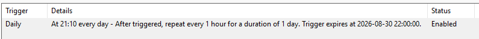
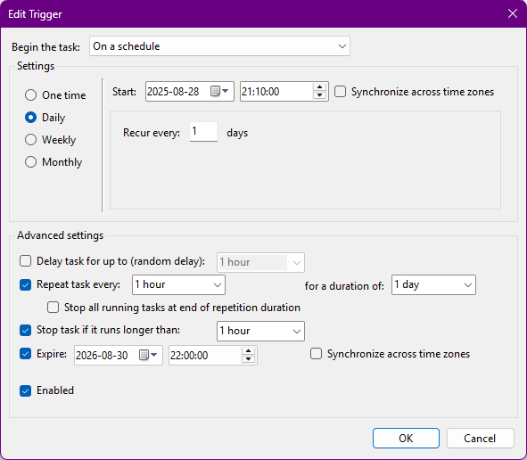
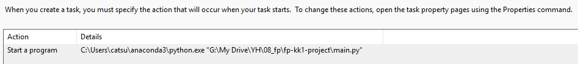
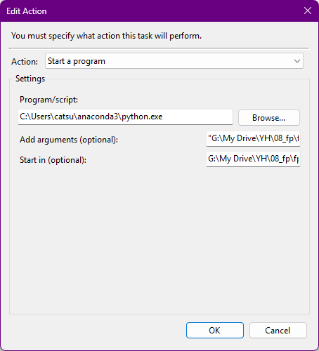
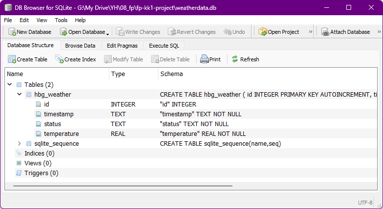
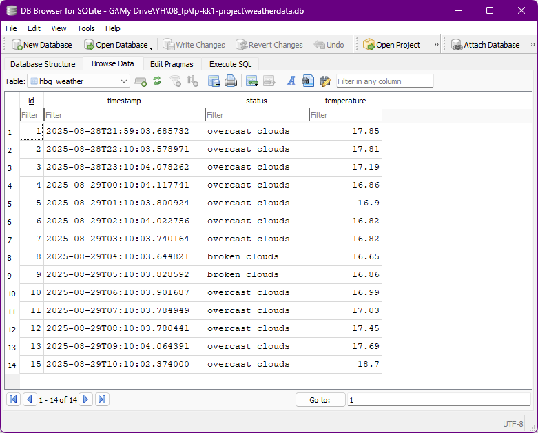
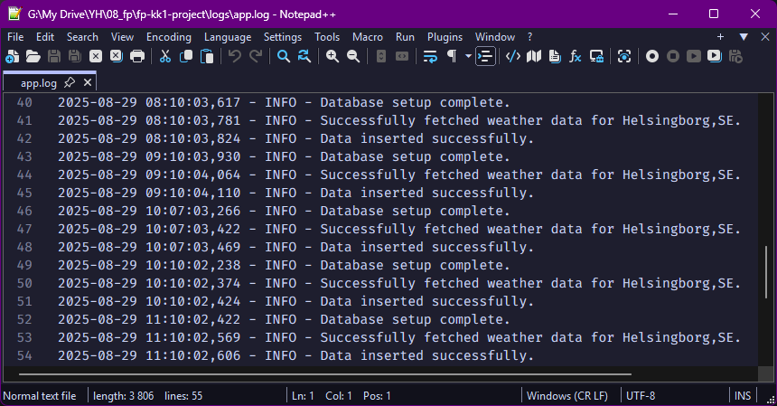

# Weather Data Collector

This project is a Python script that fetches weather data from the OpenWeatherMap (OWM) API, stores it in a SQLite database, and is scheduled to run automatically.

## Features

- Fetches current weather data (status and temperature) for a specified location.
- Stores the collected data in a local SQLite database.
- Logs script execution details, including successful operations and errors.
- Includes a suite of tests to ensure functionality and data integrity.
- Can be scheduled to run at regular intervals using Windows Task Scheduler.

## Project Structure

```
fp-kk1-project/
│
├── main.py                   # Main application script
├── test_main.py              # Pytest tests for the application
├── requirements.txt          # Project dependencies
├── weatherdata.db            # SQLite database file
├── .env                      # Environment variables (for API key)
│
├── logs/
│   └── app.log               # Log file for the application
│
└── images/
    ├── Screenshot_action.png
    ├── Screenshot_db_structure.png
    ├── Screenshot_edit_action.png
    ├── Screenshot_edit_trigger.png
    ├── Screenshot_log.png
    ├── Screenshot_table.png
    └── Screenshot_trigger.png
```

## Setup and Installation

1.  **Clone the repository:**
    ```bash
    git clone <repository-url>
    cd fp-kk1-project
    ```

2.  **Create a virtual environment:**
    ```bash
    python -m venv venv
    venv\Scripts\activate
    ```

3.  **Install the dependencies:**
    ```bash
    pip install -r requirements.txt
    ```

## Configuration

1.  **Get an OpenWeatherMap API Key:**
    - Sign up on the [OpenWeatherMap website](https://openweathermap.org/) and get your free API key.

2.  **Create a `.env` file:**
    - In the root directory of the project, create a file named `.env` and add your API key as follows:
      ```
      OWM_API_KEY=your_api_key_here
      ```

## Usage

To run the script manually, execute the following command in your terminal:

```bash
python main.py
```

This will fetch the latest weather data for Helsingborg, SE, and store it in the `weatherdata.db` database.

## Automation with Windows Task Scheduler

The script is configured to run automatically every hour using the Windows Task Scheduler.

1.  **Create a new task:**
    

2.  **Configure the trigger:**
    - Set the task to run daily and repeat every hour.
    

3.  **Define the action:**
    - Set the action to "Start a program" and provide the path to your Python executable and the `main.py` script.
    

4.  **Edit the action:**
    - Ensure the paths to the Python executable and the script are correct.
    

## Database

The project uses a SQLite database named `weatherdata.db` to store the weather data. The database contains a single table, `hbg_weather`.

**Table Schema:**


**Sample Data:**


## Logging

The script logs its operations to `logs/app.log`. This includes information about database setup, successful data fetching, and any errors that occur.



## Testing

The project includes a suite of tests written with `pytest`. To run the tests, execute the following command:

```bash
pytest
```

The tests cover the database setup, API data fetching (using mocks), and data insertion logic.
