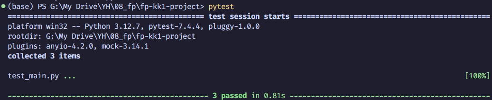

# Weather Data Collector

This project is a Python script that fetches weather data from the OpenWeatherMap (OWM) API using the [pyowm](https://github.com/csparpa/pyowm) library, stores it in a SQLite database, and is scheduled to run automatically.

## Table of Contents

- [Features](#features)
- [Project Structure](#project-structure)
- [Setup and Installation](#setup-and-installation)
- [Configuration](#configuration)
- [Usage](#usage)
- [How It Works](#how-it-works)
  - [Database Setup](#1-database-setup)
  - [Fetching Weather Data](#2-fetching-weather-data)
  - [Storing Weather Data](#3-storing-weather-data)
  - [Main Execution](#4-main-execution)
- [Automation with Windows Task Scheduler](#automation-with-windows-task-scheduler)
- [Database](#database)
- [Logging](#logging)
- [Testing](#testing)

## Features

- Fetches current weather data (status and temperature) for a specified location.
- Stores the collected data in a local SQLite database.
- Logs script execution details, including successful operations and errors.
- Includes a suite of tests to ensure functionality and data integrity.
- Can be scheduled to run at regular intervals using Windows Task Scheduler.

## Project Structure

```
fp-kk1-project/
│
├── main.py                   # Main application script
├── test_main.py              # Pytest tests for the application
├── requirements.txt          # Project dependencies
├── weatherdata.db            # SQLite database file
├── .env                      # Environment variables (for API key)
│
└── logs/
    └── app.log               # Log file for the application
```

## Setup and Installation

1.  **Clone the repository:**
    ```bash
    git clone https://github.com/PieRatCat/fp-kk1-project.git
    cd fp-kk1-project
    ```

2.  **Create and activate a virtual environment:**
    ```bash
    python -m venv venv
    venv\Scripts\activate
    ```

3.  **Install the dependencies:**
    The project requires the following Python packages:
    - `pyowm`
    - `python-dotenv`
    - `pytest`
    - `pytest-mock`

    You can install them all using the `requirements.txt` file:
    ```bash
    pip install -r requirements.txt
    ```

## Configuration

1.  **Get an OpenWeatherMap API Key:**
    - Sign up on the [OpenWeatherMap website](https://openweathermap.org/) and get your free API key.

2.  **Create a `.env` file:**
    - In the root directory of the project, create a file named `.env` and add your API key as follows:
      ```
      OWM_API_KEY=your_api_key_here
      ```

## Usage

To run the script manually, execute the following command in your terminal:

```bash
python main.py
```

This will fetch the latest weather data for Helsingborg, SE, and store it in the `weatherdata.db` database.

## How It Works

The `main.py` script is responsible for the core logic of the application. Here's a breakdown of its key components:

### 1. Database Setup
The `setup_database()` function initializes the SQLite database and creates the `hbg_weather` table if it doesn't already exist.

```python
def setup_database(db_file=DB_FILE):
    """Create the database and table if they don't exist."""
    conn = sqlite3.connect(db_file)
    cursor = conn.cursor()
    
    sql_create_table ='''
        CREATE TABLE IF NOT EXISTS hbg_weather (
            id INTEGER PRIMARY KEY AUTOINCREMENT,
            timestamp TEXT NOT NULL,
            status TEXT NOT NULL,
            temperature REAL NOT NULL
        );
    '''
    cursor.execute(sql_create_table)
    
    # Commit the changes and close the connection
    conn.commit()
    conn.close()
    logging.info("Database setup complete.")
```

### 2. Fetching Weather Data
The `get_weather_data()` function connects to the OpenWeatherMap API to retrieve the current weather status and temperature for a specified location.

```python
def get_weather_data(place='Helsingborg,SE'):
    """Fetches weather data from OWM."""
    try:
        owm = OWM(api_key)
        mgr = owm.weather_manager()

        # Current weather in Helsingborg
        observation = mgr.weather_at_place(place)
        w = observation.weather

        status = w.detailed_status
        temperature = w.temperature('celsius')
        timestamp = datetime.datetime.now().isoformat()
        
        logging.info(f"Successfully fetched weather data for {place}.")
        return (timestamp, status, temperature['temp'])
    except Exception as e:
        logging.error(f"Error fetching weather data: {e}")
        return None
```

### 3. Storing Weather Data
The `insert_weather()` function takes the fetched data and inserts it as a new record into the `hbg_weather` table.

```python
def insert_weather(data, db_file=DB_FILE):
    """Inserts weather data into the database."""
    if data is None:
        logging.warning("No weather data to insert.")
        return
        
    conn = sqlite3.connect(db_file)
    cursor = conn.cursor()    
     
    sql_insert = '''
        INSERT INTO hbg_weather (timestamp, status, temperature)
        VALUES (?, ?, ?);
    '''
    try:
        cursor.execute(sql_insert, data)
        conn.commit()
        logging.info("Data inserted successfully.")
    except sqlite3.Error as e:
        logging.error(f"Error inserting data: {e}")
    finally:
        conn.close()
```

### 4. Main Execution
The `main()` function orchestrates the entire process, calling the other functions in sequence to set up the database, fetch the data, and insert it.

```python
def main():
    """Main function to run the script."""
    setup_database()
    # Get the latest weather data and insert it into the database
    weather_data_to_insert = get_weather_data()
    insert_weather(weather_data_to_insert)

if __name__ == "__main__":
    main()
```

## Automation with Windows Task Scheduler

The script is configured to run automatically every hour using the Windows Task Scheduler.

1.  **Create a new task:**
    

2.  **Configure the trigger:**
    - Set the task to run daily and repeat every hour.
    

3.  **Define the action:**
    - Set the action to "Start a program" and provide the path to your Python executable and the `main.py` script.
    

4.  **Edit the action:**
    - Ensure the paths to the Python executable and the script are correct.
    

## Database

The project uses a SQLite database named `weatherdata.db` to store the weather data. The database contains a single table, `hbg_weather`.

**Table Schema:**


**Sample Data:**


## Logging

The script logs its operations to `logs/app.log`. This includes information about database setup, successful data fetching, and any errors that occur.


## Testing

The project includes a suite of tests written with `pytest`.

The tests cover the database setup, API data fetching (using mocks), and data insertion logic.


